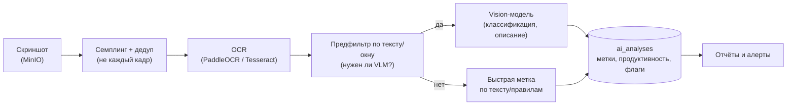

# AI-анализ скриншотов

Модуль оценивает по скриншотам, чем реально занят сотрудник, уточняет категоризацию продуктивности и подсвечивает нарушения политик. Реализуется как отдельный сервис **AI Worker** (Python), получающий задачи из очереди.

## 1. Зачем AI поверх обычной категоризации

Категоризация по процессу/домену отвечает на вопрос «какое приложение открыто», но не «что человек в нём делает». Пример: браузер открыт — это работа в CRM или просмотр соцсетей? Vision-модель по картинке понимает **содержание** экрана и даёт семантическую оценку, недоступную простым правилам.

## 2. Конвейер обработки

**Шаги**

1. **Семплинг и дедуп** — анализируем не каждый скриншот, а репрезентативную выборку; похожие кадры (мало изменений) пропускаем. Это главный рычаг стоимости.
2. **OCR** — извлекаем текст с экрана (заголовки, содержимое). Дёшево, локально, даёт основу для поиска и предфильтра.
3. **Предфильтр** — если текста/контекста достаточно для уверенной метки (правила по ключевым словам, домену, заголовку) — VLM не вызываем.
4. **Vision-модель (VLM)** — для неоднозначных случаев: описывает, что на экране, относит к категории задач, оценивает продуктивность, отмечает нарушения (посторонние приложения, неприемлемый контент).
5. **Сохранение** — метки, оценка продуктивности, флаги, модель и стоимость пишутся в `ai_analyses`, попадают в отчёты и алерты.

## 3. Выбор моделей

Режим переключаемый — под требования к конфиденциальности и бюджет.

| Режим | Модели | Плюсы | Минусы |
|-------|--------|-------|--------|
| **Облачный** | Claude (vision), GPT-4o | высшее качество, быстрый старт, без своего GPU | скриншоты уходят вовне — вопрос приватности; плата за токены |
| **Локальный** | Qwen2-VL, LLaVA, InternVL + PaddleOCR | данные не покидают периметр, фикс. стоимость | нужен GPU, качество/скорость ниже топ-облака |
| **Гибрид** | OCR+правила локально, VLM в облаке только для «сложных» | баланс цены и качества | сложнее конвейер |

> Для скриншотов рабочих станций конфиденциальность обычно критична — по умолчанию проектируем под **локальные** модели, с опцией облака при явном согласии заказчика.

## 4. Что выдаёт AI по скриншоту

- **Категория активности**: работа в задаче / коммуникации / нейтральное / развлечения / простой.
- **Оценка продуктивности** (0–100 или класс) с краткой мотивировкой.
- **Флаги нарушений**: посторонние приложения/сайты, неприемлемый контент, признаки имитации работы.
- **Краткое описание** экрана (для отчёта, без хранения самого текста дольше ретеншна).

## 5. Контроль стоимости и нагрузки

- **Семплинг**: например, 1 из N скриншотов или адаптивно (чаще при смене активности).
- **Дедупликация**: перцептивный хэш кадров — почти одинаковые не анализируем.
- **OCR-предфильтр**: дешёвый локальный шаг отсекает очевидные случаи до дорогой VLM.
- **Батчинг** запросов, кэш результатов по хэшу.
- **Приоритеты в очереди**: свежие/подозрительные кадры — вперёд.
- **Бюджеты**: лимиты на организацию/день, деградация до «только OCR» при превышении.

## 6. Приватность и корректность

- Скриншоты и производные метки подчиняются общим **ретеншн-политикам**; AI-описания не хранятся дольше исходников.
- AI-оценка — **вспомогательная**: спорные решения (особенно влияющие на штрафы) требуют проверки человеком, а не автоматического наказания.
- Отправка скриншотов во внешние модели — только при явно разрешённом облачном режиме (см. `COMPLIANCE.md`).
- Ложные срабатывания снижаются связкой «OCR + правила + VLM» и порогами уверенности.
