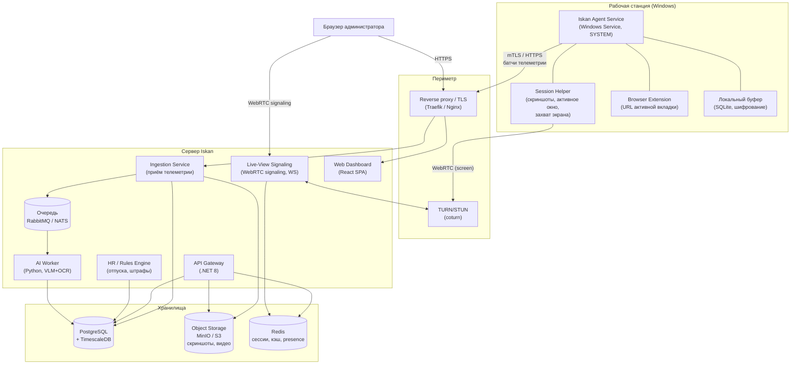

# Архитектура Iskan

Документ описывает архитектуру системы мониторинга рабочего времени: компоненты, технологический стек, потоки данных, модель данных и ключевые технические решения.

## 1. Цели и ограничения

**Функциональные цели**

- Сбор активности с ПК под Windows (окна, приложения, URL, активность/простой).
- Периодические скриншоты + опциональная видеозапись сессии.
- Категоризация времени и расчёт продуктивности.
- Живой просмотр экрана сотрудника по запросу («подключиться и смотреть»).
- HR-учёт: отпуска, больничные, график, опоздания.
- Правила и расчёт штрафов/удержаний.
- AI-анализ скриншотов (что делает сотрудник, нарушения).

**Нефункциональные требования**

- **Простое развёртывание**: сервер — Docker Compose «из коробки»; агент — тихий MSI + массовая раскатка.
- **Масштаб**: старт до ~500 агентов на одном сервере; горизонтальное масштабирование ingestion и хранилища.
- **Оффлайн-устойчивость**: агент буферизует данные локально и досылает при восстановлении связи.
- **Безопасность**: шифрование канала (mTLS), RBAC, шифрование скриншотов в хранилище, аудит доступа к «живому просмотру».
- **Приватность и право**: настраиваемые политики, уведомление сотрудника, ограничение хранения (см. `COMPLIANCE.md`).

## 2. Обзор системы



## 3. Компоненты

### 3.1. Агент (Windows)

Стек: **C# / .NET 8**, упаковка **WiX Toolset → MSI**. .NET выбран за нативную интеграцию с Win32/WinRT API, службы Windows, простую MSI-упаковку и массовую раскатку.

Агент состоит из двух процессов (обязательное разделение из-за модели сессий Windows):

1. **Iskan Agent Service** — Windows-служба под `LocalSystem`.
   - Постоянно работает, автозапуск, самовосстановление (recovery actions).
   - Управляет конфигурацией, буфером, отправкой данных, авто-обновлением.
   - Не имеет прямого доступа к рабочему столу пользователя (Session 0 isolation), поэтому порождает helper.

2. **Session Helper** — процесс в пользовательской сессии (запускается службой в активную сессию).
   - Снимает **скриншоты** и определяет **активное окно** (только процесс из интерактивной сессии может это делать).
   - Захватывает экран для «живого просмотра» через **Desktop Duplication API (DXGI)**.
   - Считает **активность/простой** по глобальным хукам ввода — только счётчики нажатий/движений и время простоя, без записи содержимого (кейлоггинг выключен по умолчанию, включается политикой).

**Что собирает агент**

| Данные | Источник | Периодичность |
|--------|----------|---------------|
| Активное окно (заголовок, процесс, путь к exe) | `GetForegroundWindow` + `GetWindowText` | при смене окна / раз в 1–5 с |
| URL активной вкладки браузера | расширение браузера или UI Automation | при смене вкладки |
| Активность / простой | глобальные хуки (счётчики), `GetLastInputInfo` | раз в 5–15 с |
| Скриншоты | GDI/DXGI capture, downscale + JPEG/WebP | 1–5 мин (настраивается), сразу thumbnail |
| Метаданные ПК | WMI (имя ПК, ОС, IP, домен, залогиненный юзер) | при старте / раз в час |
| Живой экран | Desktop Duplication + WebRTC | по запросу админа |

**Локальный буфер и отправка**

- Данные пишутся в локальный **SQLite** (шифрование ключом enrollment), батчами отправляются на сервер (сжатие gzip, интервал/размер настраиваются).
- При отсутствии сети — накапливаются; при восстановлении досылаются в порядке FIFO с дедупликацией по идемпотентному ключу.
- Скриншоты грузятся отдельным потоком с ограничением полосы (throttle), чтобы не мешать работе.

**Защита и обслуживание**

- **Enrollment**: агент регистрируется по одноразовому токену, получает клиентский сертификат (mTLS) и `agent_id`.
- **Tamper-resistance**: служба защищена от остановки не-админом, watchdog перезапускает helper.
- **Авто-обновление**: сервер публикует версию; агент скачивает подписанный пакет и обновляется.
- **Прозрачность**: опциональная иконка в трее + уведомление о мониторинге (требование законодательства — см. `COMPLIANCE.md`).

### 3.2. Сервер

Разделён на сервисы (в MVP могут жить в одном процессе/образе, дальше — раздельно).

| Сервис | Стек | Назначение |
|--------|------|-----------|
| **API Gateway** | .NET 8 (ASP.NET Core) | REST/gRPC для дашборда и агентов, аутентификация, RBAC |
| **Ingestion Service** | .NET 8 | Высоконагруженный приём телеметрии, валидация, запись в БД/очередь/хранилище |
| **HR / Rules Engine** | .NET 8 | Отпуска, больничные, график, движок правил штрафов |
| **Live-View Signaling** | .NET 8 (WebSocket) или Node | WebRTC-сигналинг между helper и браузером админа |
| **AI Worker** | Python (FastAPI + worker) | OCR + vision-анализ скриншотов, категоризация |
| **Web Dashboard** | React + TypeScript (Vite) | UI: отчёты, таймлайны, скриншоты, живой просмотр, HR, настройки |

Почему такой сплит: ядро на .NET (единый стек с агентом, производительность ingestion, зрелые библиотеки), AI вынесен в Python — там вся экосистема vision/OCR и удобная интеграция с локальными и облачными моделями. Связь ядра и AI — через очередь.

### 3.3. Инфраструктурные компоненты

- **Reverse proxy / TLS** — Traefik или Nginx: терминация TLS, маршрутизация, автосертификаты (Let's Encrypt).
- **PostgreSQL + TimescaleDB** — реляционные данные + гипертаблицы для временных рядов активности (эффективные агрегаты, компрессия, ретеншн).
- **Object Storage (MinIO/S3)** — скриншоты и видеофрагменты; шифрование на стороне сервера, lifecycle-политики удаления.
- **Redis** — сессии, presence (кто онлайн), кэш агрегатов, троттлинг.
- **Очередь (RabbitMQ или NATS)** — асинхронные задачи AI-анализа и тяжёлой агрегации.
- **coturn (TURN/STUN)** — ретрансляция WebRTC для живого просмотра при NAT.

## 4. Ключевые потоки данных

### 4.1. Сбор телеметрии

1. Helper фиксирует событие смены окна/активности → пишет в SQLite.
2. Служба раз в N секунд формирует батч → gzip → `POST /ingest/events` (mTLS).
3. Ingestion валидирует, нормализует, пишет «сырые» события в TimescaleDB и агрегирует в интервалы использования приложений.
4. Скриншоты: `POST /ingest/screenshots` (multipart) → MinIO, метаданные → PostgreSQL, задача в очередь для AI.

### 4.2. Категоризация и продуктивность

- Справочник **категорий** приложений/доменов (продуктивное/нейтральное/непродуктивное), с переопределением по отделам/ролям.
- Правила сопоставления: процесс, домен, заголовок окна → категория.
- Часть скриншотов уходит в **AI Worker** для семантической оценки (см. `AI_ANALYSIS.md`), результат уточняет категорию.
- Агрегаты (день/неделя/сотрудник/отдел) считаются фоново и кэшируются.

### 4.3. Живой просмотр экрана (по запросу)

1. Админ в дашборде жмёт «Подключиться к экрану» → проверка прав (RBAC) + запись в **аудит**.
2. API отправляет команду агенту (через постоянный WebSocket/командный канал) начать сессию захвата.
3. Helper запускает захват (Desktop Duplication) и WebRTC-поток; **signaling** обменивается SDP/ICE между helper и браузером; медиа идёт P2P/через **TURN**.
4. По завершении — остановка захвата, запись факта сессии в аудит (кто, кого, когда, длительность).

> Живой просмотр — самая чувствительная функция. Доступ строго по роли, каждая сессия логируется и (опционально) требует явного уведомления сотрудника согласно политике.

### 4.4. Штрафы

1. Rules Engine по расписанию сверяет факт (активность, присутствие, опоздания, доля непродуктивного времени) с политиками и графиком.
2. При нарушении создаётся **violation** (черновик) с рассчитанной суммой.
3. Руководитель согласует/отклоняет; утверждённые уходят в отчёт по удержаниям.

## 5. Модель данных (ключевые сущности)

```
organizations        — компании/тенанты
departments          — отделы (иерархия)
employees            — сотрудники (ФИО, отдел, роль, ставка, график)
devices              — ПК/агенты (agent_id, имя, ОС, версия, статус, привязка к employee)
users                — учётные записи доступа к системе (админ/HR/руководитель)
roles / permissions  — RBAC

activity_events      — сырые события (device_id, ts, process, exe_path, window_title, url, idle_flag)   [TimescaleDB hypertable]
activity_intervals   — свёрнутые интервалы использования (device_id, app, category, start, end, active_sec)
screenshots          — метаданные снимков (device_id, ts, object_key, thumb_key, ai_status)
screen_sessions      — сессии живого просмотра (admin_id, device_id, start, end)  — аудит

app_categories       — справочник категорий приложений/доменов
category_overrides   — переопределения по отделу/сотруднику

work_schedules       — графики работы (смены, часы)
leaves               — отпуска/больничные/отгулы (employee_id, type, start, end, status, документ)
attendance           — присутствие/опоздания (расчётные)

fine_rules           — правила штрафов (условие, формула суммы, порог)
violations           — нарушения и расчёт (employee_id, rule_id, ts, amount, status, approver)

audit_log            — журнал доступа (кто, что, когда) — особенно живой просмотр и выгрузки
ai_analyses          — результаты AI по скриншотам (screenshot_id, labels, productivity, flags, model, cost)
retention_policies   — политики хранения по типам данных
```

Разделение на «сырые события» (TimescaleDB, короткий ретеншн, компрессия) и «интервалы/агрегаты» (долгое хранение) даёт и детализацию, и экономию места.

## 6. Безопасность

- **Канал**: TLS везде; агент↔сервер — **mTLS** с клиентскими сертификатами, выданными при enrollment.
- **Аутентификация пользователей**: OIDC/SSO (Keycloak/Azure AD) или локальные учётки + 2FA.
- **RBAC**: роли (Суперадмин, HR, Руководитель отдела, Аудитор). Живой просмотр и выгрузка сырых данных — отдельные привилегии.
- **Хранение**: скриншоты/видео шифруются в объектном хранилище; ключи в KMS/секрет-менеджере.
- **Аудит**: неизменяемый журнал доступа к чувствительным данным (живой просмотр, экспорт, скриншоты).
- **Ретеншн**: автоматическое удаление по политикам (например, скриншоты — 30/90 дней), минимизация данных.
- **Изоляция тенантов**: разграничение данных по `organization_id`.

## 7. Масштабирование

- **Ingestion** — stateless, масштабируется горизонтально за балансировщиком; пик сглаживается очередью.
- **TimescaleDB** — компрессия старых чанков, continuous aggregates, ретеншн-политики; при росте — вынос в отдельный кластер.
- **Object storage** — S3-совместимое, масштабируется независимо.
- **AI Worker** — пул воркеров по глубине очереди; батчинг и семплинг скриншотов для контроля стоимости.
- **Live-view** — TURN масштабируется отдельно; медиа не проходит через прикладные сервисы.

## 8. Технологические решения — резюме

| Область | Выбор | Обоснование |
|---------|-------|-------------|
| Агент | C# / .NET 8, WiX/MSI | нативный Windows, службы, тихая раскатка |
| Захват экрана | DXGI Desktop Duplication | производительный захват для скринов и стрима |
| Живой просмотр | WebRTC + coturn | реалтайм, работа за NAT, приём в браузере без плагинов |
| Ядро сервера | .NET 8 (ASP.NET Core) | единый стек, производительность |
| AI-сервис | Python (FastAPI) | экосистема vision/OCR |
| БД | PostgreSQL + TimescaleDB | реляционка + временные ряды |
| Файлы | MinIO / S3 | масштабируемое хранение медиа |
| Очередь | RabbitMQ / NATS | асинхронный AI-конвейер |
| Кэш/presence | Redis | сессии, онлайн-статусы |
| Frontend | React + TypeScript | дашборд, таймлайны, стрим |
| Прокси/TLS | Traefik / Nginx | простое развёртывание, автосертификаты |
| Оркестрация | Docker Compose (→ K8s) | «из коробки» и путь к масштабу |

См. также: [ROADMAP.md](ROADMAP.md), [DEPLOYMENT.md](DEPLOYMENT.md), [AI_ANALYSIS.md](AI_ANALYSIS.md), [COMPLIANCE.md](COMPLIANCE.md).
