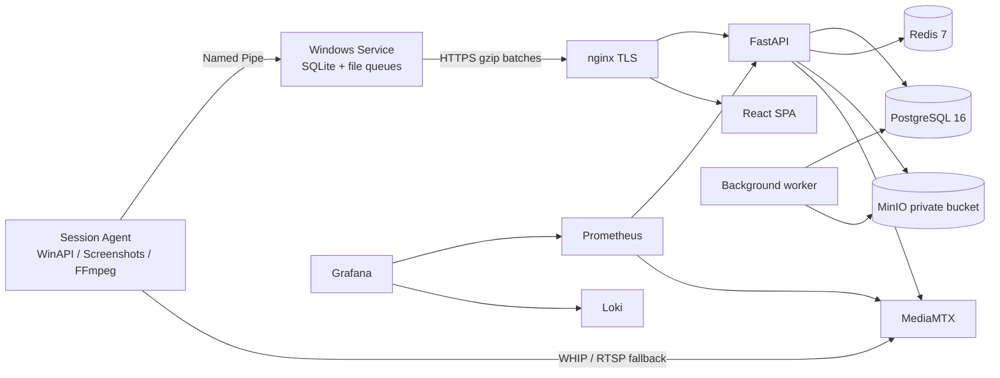
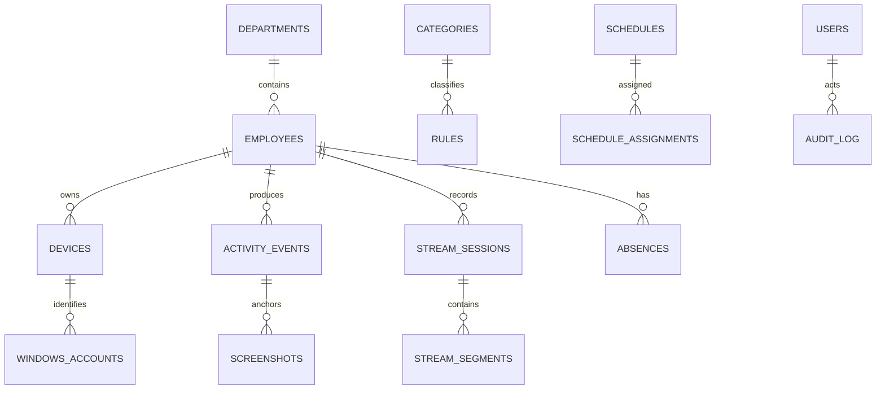

# Архитектура

Служба работает от `LocalSystem`, хранит device token через DPAPI и запускает Session Agent отдельно в каждой локальной/RDP-сессии через `CreateProcessAsUser`. Session Agent всегда показывает tray-иконку, собирает метаданные активного окна и только количественные счётчики ввода, делает снимки и запускает FFmpeg по разрешённой политике.

Очередь активности — SQLite, 7 суток/500 МБ; очередь снимков — файлы, 1 ГБ. Повторы исключаются по `event_uuid`, снимки дедуплицируются по perceptual hash.

PostgreSQL хранит оргструктуру, события, расписания, роли, аудит и индексы времени. MinIO хранит снимки, вложения, отчёты, MSI и диагностику. MediaMTX пишет fMP4 и публикует WHIP/WHEP/HLS. Redis отвечает за presence TTL, rate limit и pub/sub.

Миграции `infra/postgres/002…017` идемпотентны и выполняются контейнером `migrate` до readiness API. TimescaleDB хранит write-through hypertable `activity_samples` и continuous aggregates 1 мин / 5 мин / 1 ч / 1 день, не ломая транзакционные связи исходных событий. `worker` запускает дисциплину, рассылки, ретеншен, переклассификацию, видеополитики, индексирует фактические fMP4-файлы MediaMTX в `stream_segments` и синхронизирует завершённые/изменившиеся сегменты в MinIO.
